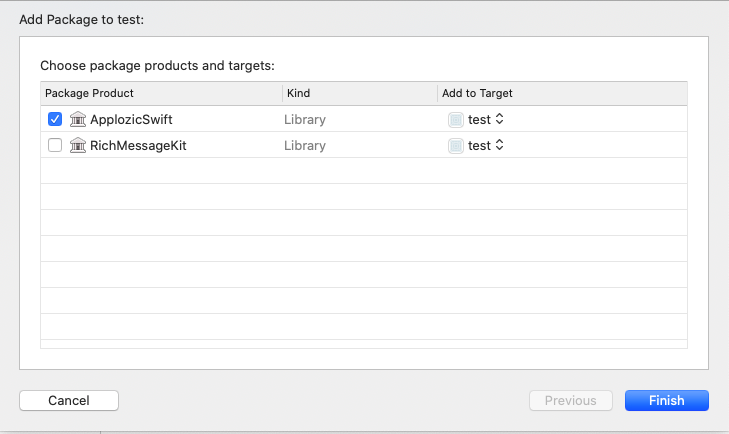
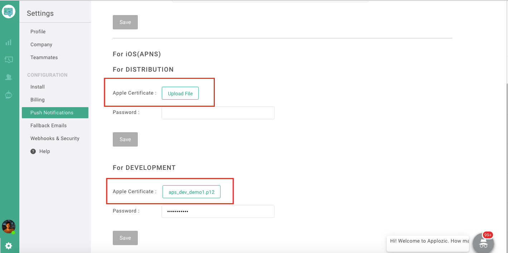
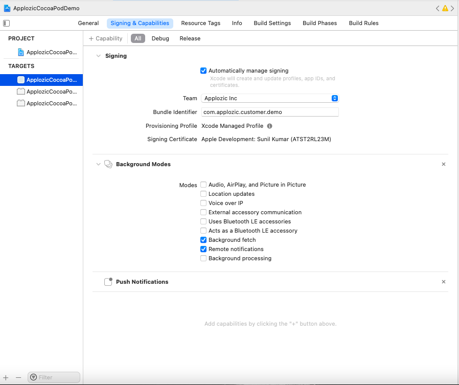

## Integrating ApplozicSwift in a Objetive-c project.

Integrating ApplozicSwift iOS SDK in your Objective-c project.

## Table of Contents :beginner:

* [Integration](#integration-sdk-in-your-app)
   * [CocoaPods](#cocopods-setup)
   * [Swift Package Manager](#spm-setup)
* [Register/Login the User](#register-login-user)
* [Push notification](#apns-push-notification-setup)
* [Conversations screen](#launch-chat-list)
* [One to one or group chat](#launch-1-to-1-or-group-chat)
* [Logout](#logout-user)

<a name="integration-sdk-in-your-app"></a>
### 1. Integration

### Include the ApplozicSwift SDK for iOS in an Existing Application

The iOS ApplozicSwift can be installed using CocoaPods or Swift Package Manager, as you prefer.

<a name="cocopods-setup"></a>
### CocoaPods

Applozic is available through [CocoaPods](https://cocoapods.org). To install
it

1. Open Terminal
2. Navigate to the root directory of your Project (the directory where your *.xcodeproj file is)
3. Run command

```bash
pod init
```

Again go to your Project's root directory, click on the "Podfile" to open.
Copy-paste the following code in the file and Save

```ruby
source 'https://github.com/CocoaPods/Specs'
use_frameworks!  # Required to add 
platform :ios, '10.0'

target 'TARGET_NAME' do
    pod 'ApplozicSwift'  # Required to add 
end
```

4. Go to your project directory where Podfile there run `pod install` or `pod update` from terminal to refresh the CocoaPods dependencies.

5. Open your project newly generated `*.xcworkspace` or existing and build your project.

<a name="spm-setup"></a>
### Swift Package Manager

1. To integrate ApplozicSwift SDK into your Xcode project using Swift Package Manager, specify the GitHub URL in options 
  * Xcode -> File -> Swift Packages -> Add Package Dependency:

```swift
https://github.com/AppLozic/ApplozicSwift.git
```
2. Once you click the Next button Select the ApplozicSwift package product and it will look like below and click finish

   

**Note** : Make sure you have linked your GitHub account from your Xcode to integrate Swift Package Manager of ApplozicSwift

### Add Permissions

App Store requires any app which accesses camera, contacts, gallery, location, a microphone to add the description of why does your app needs to access these features.

In the Info.plist file of your project. Please add the following permissions

```xml
 <key>NSCameraUsageDescription</key>
 <string>Allow Camera</string>
 <key>NSContactsUsageDescription</key>
 <string>Allow Contacts</string>
 <key>NSLocationWhenInUseUsageDescription</key>
 <string>Allow location sharing!!</string>
 <key>NSMicrophoneUsageDescription</key>
 <string>Allow MicroPhone</string>
 <key>NSPhotoLibraryUsageDescription</key>
 <string>Allow Photos</string>
 <key>NSPhotoLibraryAddUsageDescription</key>
 <string>Allow write access</string>
```

### Importing Methods for Authentication

The method file that we need here is `ALChatManager` files.

1. Download the `ALChatManager.swift` [here](https://github.com/AppLozic/Applozic-Objective-C-Sample-App/blob/main/ApplozicSwiftObjcSample/ALChatManager.swift)  and add the downloaded `ALChatManager.swift` in your project add the bridging header if it asks.
2. Open `ALChatManager.swift` file in your Xcode and Replace "applozic-sample-app" with your App ID from [here](https://console.applozic.com/settings)

<a name="register-login-user"></a>
### 2. Register/Login the User

Login or register the user in applozic using below code.

Add the import in your class for accessing

```objective-c
@import ApplozicSwift;
@import ApplozicCore;
```

```objective-c
// Creating "ALUser" and Passing user details
// Except UserId all the other parameters are optional

ALUser * user = [[ALUser alloc] init];
[user setUserId:@"USER-ID"];
[user setDisplayName:@"USER-DISPLAY-NAME"];
[user setPassword:@"USER-PASSWORD"];
[user setAuthenticationTypeId:(short)APPLOZIC];

[ALUserDefaultsHandler setUserAuthenticationTypeId:(short)APPLOZIC];

[[ALChatManager shared] connectUser:user completion:^(ALRegistrationResponse * response, NSError * error) {
     if (error){
         NSLog(@"Error in login to applozic %@", error.localizedDescription);
         return;
     }
     NSLog(@"Applozic login success");
}];
```
<a name="apns-push-notification-setup"></a>
### 3. Push notification

#### Setting up APNs Certificates
Applozic sends the payload to Apple servers which then sends the Push notification to your user's device.

#### Creating APNs certificates

For Apple to send these notifications, would have to create an APNs certificate in your Apple developer account.

1. Visit this [link](https://developer.apple.com/account/resources/certificates/add), to create Apple Push Notification service SSL (Sandbox) i.e development certificate

   


2. Visit this [link](https://developer.apple.com/account/resources/certificates/add), to create Apple Push Notification service SSL (Sandbox & Production) i.e distribution certificate

   


Once the certificates are created you can download them and export the p12 files with password for development and distribution certificate either from Keychain Acess from Mac.  

#### Upload APNs Certificates

Upload your push notification certificates (mentioned above) to the Applozic console by referring to the below-given image.

Go to Applozic [console](https://console.applozic.com/settings/pushnotification) push notification section to upload the APNs development and distribution certificates

   


#### Adding Capabilities to Your App

Add capabilities to configure app services from Apple, such as push notifications, Background modes

1. On the Xcode project’s Signing & Capabilities tab, Click (+ Capability) to add “Push Notifications”

2. Next Click (+ Capability) to add "Background modes" enable this below four options from Background modes

 * "Background fetch"
 * "Remote notifications"
 
The following screenshot would be of help.


 
#### Configure the push notification in the Appdelegate file of your project.

Add the below code in AppDelegate.m file If some of the methods exits then copy-paste the code inside methods.

```objective-c

#import "AppDelegate.h"
#import "YOUR_TARGET_NAME_HERE-Swift.h" /// Important: Replace 'YOUR_TARGET_NAME_HERE' with your target name.
#import <UserNotifications/UserNotifications.h>

/// Add this UNUserNotificationCenterDelegate in your Appdelegate file
@interface AppDelegate () <UNUserNotificationCenterDelegate>

@end

@implementation AppDelegate


- (BOOL)application:(UIApplication *)application didFinishLaunchingWithOptions:(NSDictionary *)launchOptions {
    // Override point for customization after application launch.

    // Push notification delegate setup
    UNUserNotificationCenter.currentNotificationCenter.delegate = self;
    return [ALChatManager.shared application:application didFinishLaunchingWithOptions:launchOptions];
}


-(void)application:(UIApplication *)application didReceiveRemoteNotification:(NSDictionary *)userInfo fetchCompletionHandler:(nonnull void (^)(UIBackgroundFetchResult))completionHandler {

    [ALChatManager.shared application:application didReceiveRemoteNotification:userInfo fetchCompletionHandler:^(UIBackgroundFetchResult backgroundFetchResult) {
        // Perform your other operations here
        completionHandler(backgroundFetchResult);
    }];
}

- (void)userNotificationCenter:(UNUserNotificationCenter *)center willPresentNotification:(UNNotification*)notification withCompletionHandler:(void (^)(UNNotificationPresentationOptions options))completionHandler {

    [ALChatManager.shared userNotificationCenter:center willPresent:notification withCompletionHandler:^(UNNotificationPresentationOptions options) {
        completionHandler(options);
    }];
}

- (void)userNotificationCenter:(UNUserNotificationCenter *)center didReceiveNotificationResponse:(nonnull UNNotificationResponse* )response withCompletionHandler:(nonnull void (^)(void))completionHandler {

    [ALChatManager.shared userNotificationCenter:center didReceive:response withCompletionHandler:^{
        completionHandler();
    }];
}

- (void)applicationWillEnterForeground:(UIApplication *)application {
    // Called as part of the transition from the background to the inactive state; here you can undo many of the changes made on entering the background.
    [ALChatManager.shared applicationWillEnterForeground:application];
}

- (void)applicationWillTerminate:(UIApplication *)application {
    // Called when the application is about to terminate. Save data if appropriate. See also applicationDidEnterBackground:.
    [ALChatManager.shared applicationWillTerminateWithApplication:application];
}

- (void)application:(UIApplication *)application didRegisterForRemoteNotificationsWithDeviceToken:(NSData *)deviceToken {
    [ALChatManager.shared application:application didRegisterForRemoteNotificationsWithDeviceToken:deviceToken];
}

@end
```
<a name="launch-chat-list"></a>
### 4. Launch chat list

Implement the following code at the event or Button action designated for showing chat list screen.

```objective-c
[ALChatManager.shared launchChatListFrom:self];
```
<a name="launch-1-to-1-or-group-chat"></a>
### 5. Launch one to one or group chat

a. One to one conversation

To launch One to one chat pass the `RECEIVER-USERID` that you want to launch chat for.
```objective-c
[ALChatManager.shared launchChatWithContactId:@"RECEIVER-USERID" from:self prefilledMessage:nil];
```
b. Group conversation

To launch Group chat pass the `CLIENT-GROUPID` that you want to launch chat for.

```objective-c
[ALChatManager.shared launchGroupWithClientGroupId:@"CLIENT-GROUPID" from:self prefilledMessage:nil];
```
<a name="logout-user"></a>
### 6. Logout user

On logout of your app you need to logout the applozic user as well use the below method to logout the user:  

```objective-c
[ALChatManager.shared logoutUserWithCompletion:^(BOOL sucess) {
     if (sucess) {
        NSLog(@"Logout success");
     }
}];
```
